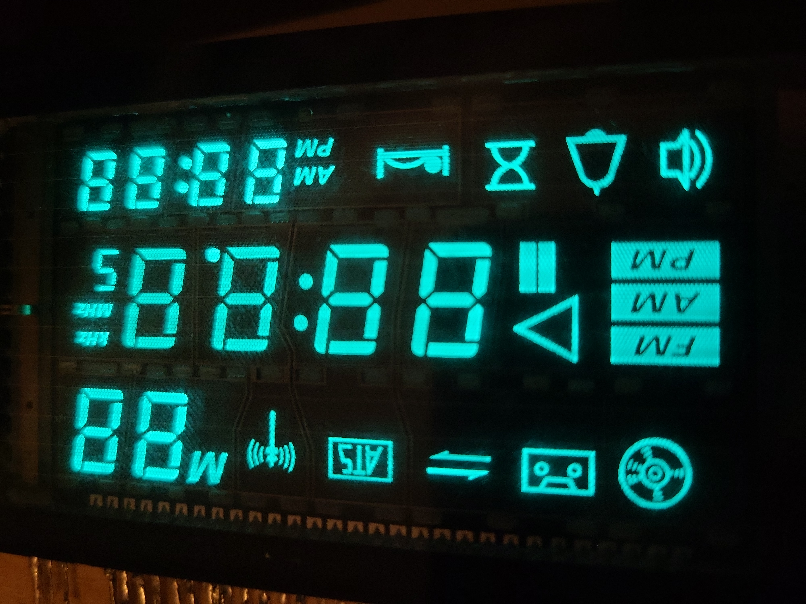
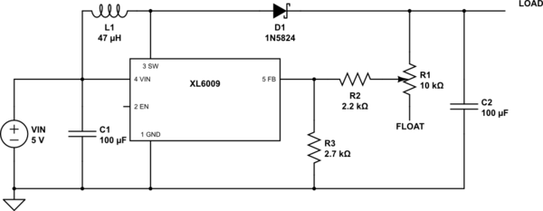

---
tags:
  - Projekte/VFD-Wecker
---

# 1. Auswahl der Schaltung
Für dieses Projekt habe ich mich entschieden, eine alte Fluoreszenz-Anzeige aus einem auseinandergenommenen Küchenradio wieder funktionstüchtig zu machen. Es handelt sich um ein *Vacuum Fluorescent Display* mit mehreren 7-Segment-Anzeigen und einigen Symbolen auf insgesamt 11 Feldern.
## Warum habe ich diese Schaltung gewählt?
Ich habe die Schaltung der Fluoreszenz-Anzeige gewählt, da sie einige interessante Mechanismen und Funktionsweisen der Elektronik in Anwendung zeigt. Fluoreszenzanzeigen wurden schon vor Jahrzehnten durch LED-Anzeigen ersetzt, die leichter anzusteuern, günstiger zu produzieren und kompakter zu bauen sind. Da wir in Lernfeld 06 aber sowieso "back to basics" gehen und zum Beispiel analoge Transistorschaltungen analysieren, finde ich es sehr passend.
## Welche Problematik löst die Schaltung?
Grundlegend löst die Schaltung kein explizites Problem in meinem Leben. Als historisches Bauteil bietet die Fluoreszenzanzeige aber interessante Vorteile gegenüber regulären LED-Anzeigen. 
So haben sie eine hohe Lebensdauer, einen weiten Sichtwinkel und, zumindest in der Theorie, eine hohe Helligkeit bei exzellentem Kontrast.
# 2. Aufbau der Schaltung 
## Spannungswandler
Für die Spannungsversorgung habe ich ein 12V-Netzteil gewählt.
Für das Projekt benötige ich 3 Spannungsebenen:
1. 5V für den Arduino Nano + IO-Expander
2. 3V für die Filamentspannung
3. 32V für die Anodenspannung
Dementsprechend muss die Spannung runter- und hochgestuft werden. Dafür nutze ich Buck-Converter, da sie eine sehr hohe Effizienz und stufenlose Einstellbarkeit der Ausgangsspannung bieten.
### Buck/Boost-Converter
Buck/Boost Converter sind kompakte Spannungswandler, die mithilfe eines einzelnen ICs (integrierten Schaltkreises) Spannung hoch- oder herunterregeln können.
Diese Schaltungen machen sich die Eigenschaften von Spulen, Kondensatoren und Dioden kombiniert mit einem IC zum geregelten Schalten von Spannung zu nutzen.
Die Funktionsweise der Varianten werden auch in dieser hervorragenden Animation veranschaulicht: `https://youtu.be/vwJYIorz_Aw`

[](https://www.youtube.com/watch?v=vwJYIorz_Aw)


### Step-Down Converter
Dieser Step-Down Converter basiert auf dem `LM2596S`-IC und nutzt die Eigenschaften von Spulen, Strom zunächst zu blockieren und ihn erst langsam durchzulassen, sowie die energiespeichernden Eigenschaften von Kondensatoren. Der Kondensator wird in regelmäßigen Abständen über den IC mit der Eingangsspannung verbunden, es kann jedoch nur ein begrenzter Strom fließen, da er durch eine Spule ausgebremst wird.
Zwischen der Ausgangsspannung und Gnd befindet sich ein Spannungsteiler, der über ein Potentiometer gesteuert eine Feedback-Spannung an den IC gibt, was die Zeitdauern beeinflusst, die eine Spannung anliegt.

*(Beispiel für Buck Converter mit `LM2596S`)*
### Step-Up Converter
Der Step-Up Converter nutzt den `XL6009E1`-IC, der sowohl als Boost- als auch als Buck-Converter genutzt werden kann. 
Anders als beim Step-Down Converter wird hier ein hoher Strom durch die Spule über Pin3 `SW`(Switch) geleitet. Dann schaltet der IC die Verbindung zu Gnd weg; nun fließt der hohe Strom über eine Schottky-Diode zum Ausgang und lädt einen Kondensator auf. Dieser speichert die Energie und entlädt sich langsam, während die Spule wieder "aufgeladen" wird. Auch hier findet sich ein Spannungsteiler, der die Ausgangsspannung über Widerstände und ein Potentiometer an den Feedback Pin des ICs schickt.

*(Beispiel für Boost Converter mit `XL6009`)*
## Fluoreszenz-Anzeige

Eine Fluoreszenz-Anzeige funktioniert grundlegend durch die Eigenschaft von Phosphor-Beschichtungen, zu leuchten, wenn sie von Elektronen getroffen werden. Damit sich diese Elektronen frei bewegen können, muss sich das Display in einem Vakuum befinden.
Darum heißt es auf Englisch auf "*Vacuum Fluorescent Display*", oder kurz *VFD*. 
Das VFD zählt zu der Familie der Elektronenröhren, es findet sich in seiner Funktionalität zwischen der Braunschen Röhre (Röhrenfernseher) und der Triode. Es nutzt die Steuerung von Elektronen sowohl zur Beleuchtung als auch zur Verknüpfung mehrerer Felder:

Wie in der Grafik zu sehen ist, können Elektronen die einzelnen Phosphor-beschichteten Anoden nur dann erreichen, wenn sowohl die Anode als auch das Feld eine positive Spannung anliegen haben.
### Multiplexing
Diese Bedingung von anliegender Spannung bei Gitter und Anode kann genutzt werden, um mehrere Anoden über gemeinsame Anschlüsse anzusteuern. 
Dafür schaltet das Programm sich durch die einzelnen Felder und schaltet die Felder an, die für das abzubildende Endergebnis an sein müssen. Diese Grafik zeigt das sehr gut: Die Felder G1 bis G5 werden nacheinander an- und ausgeschaltet, zusätzlich dazu werden die einzelnen Anoden zugeschaltet.

Anders als beim starren Ansteuern eines Displays muss nun allerdings das komplette Display etliche Male pro Sekunde durchlaufen werden, um ein konsistentes und flacker-freies Bild zu erschaffen. Dabei wird eine Frequenz von mind. 50Hz empfohlen.
### Filament
Das Filament verläuft über das gesamte Display. Hier liegt eine Spannung von ca. 3V DC an. Die meisten kommerziellen Lösungen arbeiten allerdings mit AC, also Wechselspannung, da so das Display eine gleichbleibende Helligkeit auf der gesamten Länge hat. Je höher die Spannung, desto stärker die Leuchtkraft - jedoch reduziert sich auch die Lebensdauer. Es ist sogar möglich, das Filament zum Schmelzen zu bringen. Daher ist es ratsam, die Spannung so einzustellen, dass es gerade so glüht, dass man das Glühen bei genauerer Betrachtung in einem abgedunkelten Zimmer sehen kann.
Da sich das Filament beim Erwärmen auch ausdehnt, sind alle Filament-Drähte über kleine Federn gespannt, die die Drähte gleichmäßig straff halten.
### Gitter-Anoden
Die Gitter-Anoden sind für das Multiplexing essentiell. Hier sind die einzelnen Zonen gut zu sehen: In jeder Zone befindet sich genau eine 7-Segment Ziffer sowie einige Symbole.


### Anoden
Die Anoden bilden das letzte Ziel der Elektronen. Hier prallen die Elektronen auf die Phosphorbeschichtung und bringen sie zum Fluoreszieren.
## Darlington-Array
Ein wichtiger Grund, warum Fluoreszenz-Anzeigen an Popularität verloren haben, ist die Tatsache, dass sie mit Spannung bis über 30 Volt arbeiten. LED-Anzeigen hingegen operieren oft mit Spannungen von 5V oder sogar 3.3V, daher ist es deutlich leichter, sie anzusteuern.
Für VFDs hingegen benötigt man irgendeine Möglichkeit, von z.B. 5V Logik-Pegel auf 32V zu schalten. Das geht am besten mit sogenannten Darlington-Arrays. 
Eine Darlington-Schaltung entsteht durch das Verketten von Transistoren, um eine enorme Stromverstärkung zu ermöglichen. Der untere Schaltkreis ist der eines einzelnen Treibers aus einem Darlington-Array. Hier werden 8 solcher Darlington-Treiber mit gemeinsamer Spannungsversorgung bereitgestellt. Dieser IC ist speziell für das Betreiben von Fluroreszenz-Anzeigen entwickelt worden.


## weitere Bauteile
### Arduino Nano
Der Arduino Nano hat sich schon seit langer Zeit für die verschiedensten Projekte erwiesen. Er ist klein, verlässlich und hat den Support einer riesigen Bastler-Community hinter sich, was die meisten Projekte deutlich erleichtert.  
### IO-Expander: MCP23017
Leider bietet der Arduino Nano nur 13 digitale Ausgänge, was nicht zum Ansteuern der Fluoreszenzanzeige ausreicht. Daher verwende ich hier einen IO-Expander, der die zusätzlichen Ausgänge zur Verfügung stellt.
### RTC-Modul
Um dem Projekt auch praktisches Nutzen zu geben, habe ich ein RTC (Real Time Clock)-Modul verbaut. Die aktuelle Uhrzeit wird vom Arduino ausgelesen und auf dem VFD angezeigt.
# 3. Schaltpläne und Konzepte
Als EDA-Programm meiner Wahl verwende ich KiCad, da ich so auf die Ressourcen einer sehr großen Community zurückgreifen kann. Außerdem ist es Open-Source, was heutzutage immer wichtiger wird.


Hier zu sehen ist der Schaltplan für den Arduino Nano, den IO-Expander, das RTC-Modul, die Darlington-Arrays sowie die Anschlüsse für das Fluoreszenz-Display. Für letzteres habe ich eigene Bauteile erstellt.


Hier ist ein möglicher Aufbau auf einer Leiterplatte. Leider habe ich hierfür keine Zeit oder Ressourcen mehr gehabt, weswegen das Projekt zunächst als Proof of Concept auf mehreren Breadboards lebt.
Für diesen Aufbau habe ich den obigen Schaltkreis optimiert, auch die Darstellung in 3D hat hierbei geholfen.


# 4. Programmierung
Das finale Ergebnis des Projektes ist eine Uhr, die die Stunden, Minuten und Sekunden anzeigt.
Hierfür habe ich ein Arduino-Programm mit mehreren Subroutinen geschrieben, was für eine deutlich übersichtlichere Struktur sorgt.
So besteht mein `void loop()` aus nur 3 Befehlen:
```C++
void loop() {
  RTC_UhrzeitErfassen();  // abspeichern der Zeit in Variabeln
  UhrzeitZuArray();       // Übersetzen der Zeit in Array
  // Ansteuern des Displays mit Werten aus dem Array:
  VFDAnsteuerung(50,100); // frequenz von 50 und Helligkeit von 100%
}
```

# 5. Fazit
Ich bin mit dem Endergebnis größtenteils zufrieden. Das Schulprojekt hat mir die Gelegenheit geboten, mich wieder einmal mit diesem spannenden Thema zu befassen und Neues zu lernen. Leider bin ich wieder am Zeit-Management gescheitert, wobei auch hier externe Faktoren dazuzählten. Für ein Projekt, dass man mal eben neben Schule & Ausbildung auf die Beine stellt, war dieses vermutlich etwas hoch gegriffen.
